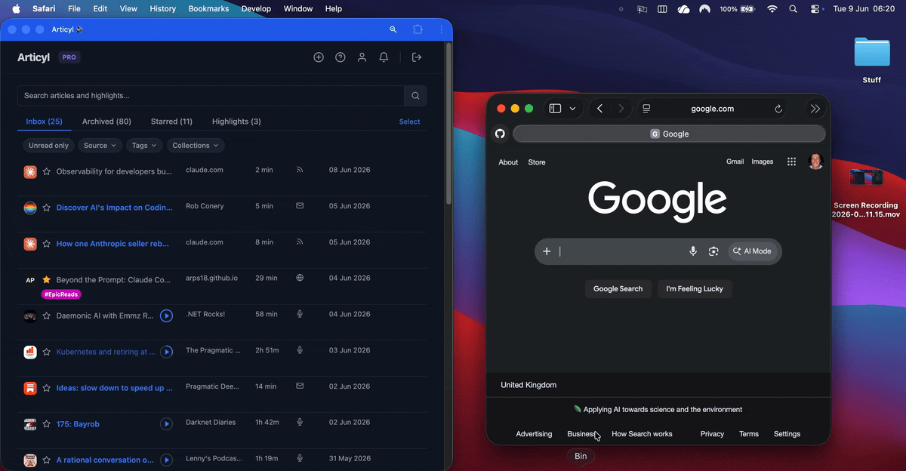
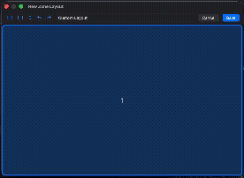

# Zones

**FancyZones-style window snapping for macOS.**

Carve your screen into a custom grid of zones, then snap windows into place by mouse or keyboard — like Windows PowerToys FancyZones, built natively for the Mac. Zones runs as a lightweight menu-bar agent with no Dock icon.

## What it does

- ✏️ **Custom zones** — build your own layouts in the visual editor: split a cell left/right or top/bottom, drag the dividers to resize, and merge cells back together. Saved layouts appear in the menu bar and persist across launches. Zones are stored as fractions of the display, so a layout looks identical on a laptop screen or a 4K monitor.

  

- 🖱️ **⇧ Shift + drag** — hold Shift while dragging any window to light up your zones, then release to drop it into the one under the cursor.

- ⌨️ **⌃⌥ + arrow keys** — hold Control-Option and tap the arrow keys to move the focused window between zones without the mouse. The overlay stays up while you hold the keys, so you can keep tapping to walk a window across the layout.

## Install

Zones runs on **macOS 14 (Sonoma) or later** and needs **Accessibility** permission (it asks on first launch — required to move windows).

1. Download `Zones-<version>.dmg` from the [**Releases**](../../releases) page, open it, and drag **Zones.app** into your `Applications` folder.
2. Zones is **self-signed, not yet notarised by Apple**, so macOS blocks the first launch as coming "from an unidentified developer." You only need to clear this once:
   - **macOS 14 Sonoma:** right-click **Zones.app → Open**, then confirm in the dialog.
   - **macOS 15 Sequoia or later:** double-click it (it'll be blocked), then open **System Settings → Privacy & Security** and click **Open Anyway**.
   - Or skip the dialogs entirely: `xattr -dr com.apple.quarantine /Applications/Zones.app`
3. That's the only warning you'll see — **Zones updates itself automatically** from then on.

Once it's running, click the split-rectangle icon in the menu bar to toggle snapping, pick or edit a layout, or check for updates.

## License

Zones is released under the [MIT License](LICENSE).
